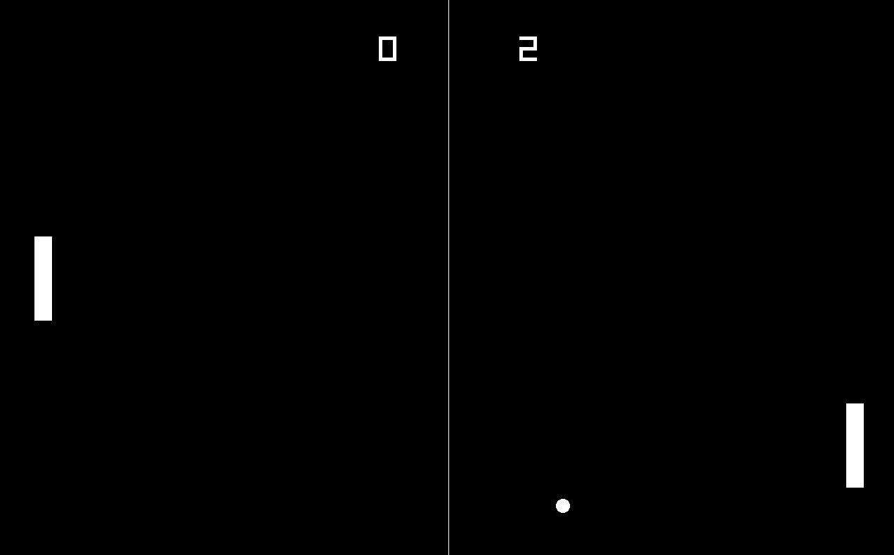
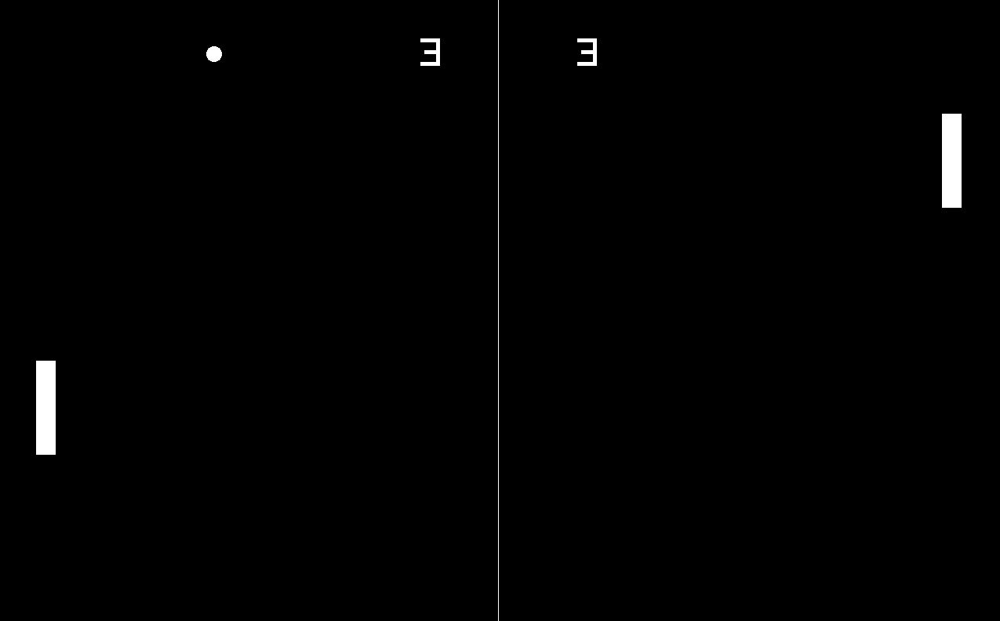

# PONG 🚀 - My first c++ mini project

## Description

I created a replica of the classic pong game using C++. In my version, players can compete against against a CPU player. The game features a scoring system to keep track of each player's points.

## Screenshots

Here are some screenshots of the game:

## How to Play

To play the game, use the keyboard W/S keys to control the movement of your paddle. The objective is to hit the ball with your paddle and prevent it from reaching your side of the screen. Each time the ball passes your paddle, the opposing player earns a point. The first player to reach a certain number of points wins the game.

## Installation

To install and run the game, follow these steps:

1. Clone the repository to your local machine.
2. Open the project in your preferred C++ IDE.
3. Build and compile the code.
4. Run the executable file to start the game.
